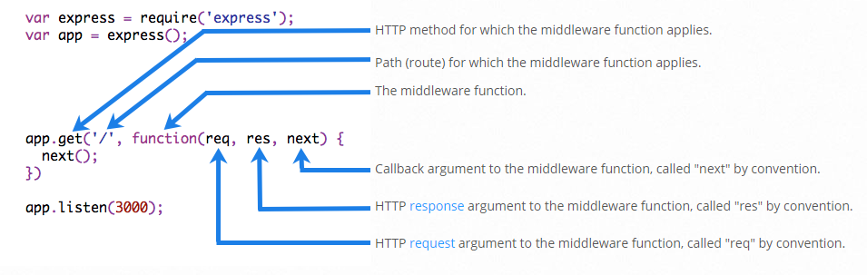

# Express JS
Also known as express framework. **Express is minimal and flexible Web Server framework based for NodeJS**. We can create a simple web server with a few lines of javascript code. This is a open source framework and maintained by **Node.js** foundatation. Official Website: https://expressjs.com

### Capabilities
* Fast light weight web server
* Can host static web contents
* Can host REST API easily.
* Supports middleware (a javascript library that can plug-in to express to extend functionality)
  * We can create our own middleware easily
  * A lot of free middlewares are available for different purposes

# [1] Basics
## [1.1] Installation
Easy to install with the following command:
> npm install express --save
## [1.2] Basic Sample
A basic hello world sample of express consists of just 6 lines of code:
```javascript 
/** filename: Server.js */
// Import the express module
const express = require('express');
// Create an object of express
const app = express();
// HTTP GET handler for root url (/) will return "Hello world!" message
app.get('/', function(req, res){
    res.send("Hello world!");
});
// Listen in the target port
app.listen(8080);
```
## [1.3] Run the web server
A simple commad line can run this nodejs app:
> node Server.js

## [1.4] Static content
We can host static content in express simply using the static middleware which is part of express framework (from v4.x onwards).
```javascript
// Import the express module
const express = require('express');
// Create an object of express
const app = express();

// Host the contents of subfolder './static' in the path /public
// This means we can access them using url: http://localhost:8080/public/index.html
app.use('/public', express.static('./static'));
// Listen in the target port
app.listen(8080);
```
* The `express.static('./static')` statement creates an instance of middleware express.static which will server static content. The contents will be taken from the folder './static'. The path can be relative or absolute path.
* The `app.use('/public', ...)` part of the statement specifies that the express should host the middleware in the url http://localhost:8080/public
* The combined statement `app.use('/public', express.static('./static'));` ensures the static content from sub-folder './static' is hosted in url: `http://localhost:8080/public`.
* For example, the url "http://localhost:8080/public/index.html" will load the file "./static/index.html" in the browser as static website.

## [1.5] Using nodemon
We can also install nodemon package globally and use it to run express server. With node we just start app one time. For every edit on the javascript code it will automatically reload the application (web server).
> npm install -g nodemon
> 
> nodemon -w ./ Server.js

The above command will start the Server.js script (using node) and then monitor the folder './' (i.e., current folder) and if any file is modified inside the currentfolder it will restart the Server.js script. If the file is modified multiple times, it will restart any file in the current folder is modified.

If we do not want to install nodemon globally, then we can install as dev dependency and run it using npx:
> npm install --save-dev nodemon
> 
> npx nodemon -w ./ Server.js

# [2] Advanced
## [2.1] Express Routing
Detailed documentation available in https://expressjs.com/en/guide/routing.html from the official website
### [2.1.1] Route Methods (HTTP methods)
Express supports all http methods. We can create a handler for one of the http method or all of the http methods for a given relative url.
```javascript
const express = require('express');
const app = express();
app.get('/users', (req, res) => {
    // Handle HTTP GET for url http://localhost:8080/users
    res.send('HTTP GET request for /users');
});
app.post('/users', (req, res) => {
    // Handle HTTP POST for url http://localhost:8080/users
    res.send(`HTTP POST requeset for /users`);
});
app.all('/all', (req, res) => {
    // Handle any HTTP method for url http://localhost:8080/all
    res.send(`HTTP ${req.method} received for /all`);
});
app.listen(8080);
```
The express object has one method each for a http method (example: `app.get()` is HTTP GET). We can also use the `all` method to specify that express should handle all supported HTTP methods.

### [2.1.2] Route Path (relative Urls)
* The first argument of `app.get()` or `app.post()` or `app.all()` method is the route path (or relative url) and the second argument is the handler method. 
* The handler method takes two arguments: `Request`, `Response`.
The express route path (or relative url) can contain a normal string or a regular expression. 
* A route path also supports parameterized urls.

#### :one: Defining Routes
We can define a route (a.k.a relative url) and assign a handler to this route. Example the following script handles the route `/library/books` (relative url: HTTP GET http://localhost:8080/library/books):
```javascript
const express = require('express');
const app = express();
app.get('/library/books', (req, res) => {
    // route: /library/books
    // acutal url: HTTP GET http://localhost:8080/library/books
    res.send('This is the list of books');
});
app.listen(8080);
```
#### :two: Route path regular expression
We can also use a regular express to define a route like this: 
```javascript
const express = require('express');
const app = express();
app.get('/library/books/*', (req, res) => {
    // route: /library/book/*
    // acutal url: HTTP GET http://localhost:8080/library/books/book1
    // acutal url: HTTP GET http://localhost:8080/library/books/123
    const relativePath = req.path.split('/').slice(1).join('/');
    const bookName = relativePath.split('/').slice(2).join('/');
    res.send(`Relative url: <em>${relativePath}</em> will find the book <b>${bookName}</b>`);
});
app.listen(8080);
```
#### :three: Parameterized routes
The components of a route can be converted to parameters by prefixing the part of the route with a `:` symbol. For example the route `/libary/books/:category/:name` will match the url `http://localhost:8080/library/books/math/algebra`. The handler code can access the parts of the url as `req.params.category` (the _:category_ in the path) and `req.params.name` (the _:name_ in the path). Example:

```javascript
const express = require('express');
const app = express();
app.get('/library/books/:category/:name', (req, res) => {
    // route: /library/books
    // acutal url: HTTP GET http://localhost:8080/library/books/math/algebra
    const msg = `Find book <b>${req.params.name}</b> `+ 
        `under category: <em>${req.params.category}</em>`
    res.send(msg);
});
app.listen(8080);
```
For the url: `http://localhost:8080/library/books/math/algebra` the response will be:
>Find book __algebra__ under category: _math_

#### [2.1.3] Route Handlers
##### :one: Simple Handler
The handler for a route is a simple function that takes two parameters: `request`, `response`. 
**Example 1**
```javascript
const express = require('express');
const app = express();
app.get('/', (req, res) => {
    res.send('hello world');
});
app.listen(8080);
```
**Example 2**
```javascript
const express = require('express');
const app = express();
function getRoot(req, res) {
    res.send('hello world');
}
app.get('/', getRoot);
app.listen(8080);
```

##### :two: Chaining Handlers
We can have multiple handlers for a single route connected as a chain. To chain more than one handler we need to call the `next()` method at the end of every handler. The `next` is actually the third parameter for the handler.
**Example 1:**
```javascript
const express = require('express');
const app = express();
app.get('/', (req, res, next) => {
    if (req.headers['user']) {
        req.params.user = req.headers['user'];
    }
    next();
}, (req, res) => {
    res.send(`Hello ${req.params.user || 'guest'}`);
});
app.listen(8080);
```
**Example 2:** We can also chain multiple handlers by passing them like an array like this:
```javascript
const express = require('express');
const app = express();
function auth(req, res, next) {
    req.params.user = req.headers['user'] || req.params.user || 'guest';
    next(); // Call next() to ensure next handler in the chain is invoked
}
function content(req, res) {
    res.send(`Hello ${req.params.user}`);
}
app.get('/', [auth, content]); // add a handler chain as an array
app.listen(8080);
```
#### [2.1.4] app.route()
We can also create multiple handlers for a single route like one handler per http method like this:
```javascript
const express = require('express');
const app = express();
app.route('/books').get((req, res) => {
    res.send('Get the list of books');
}).post((req, res) => {
    res.send('Accept a new book');
}).delete((req, res) => {
    res.send('Remove a book');
});
app.listen(8080);
```
The benefit of this approach is that we can avoid typos in the route path. If one handler (e.g: GET) works then definitely all other handlers for the same route will also work.


## [2.2] Using express.Router
We can add multiple routes to an express application. Each route can do a specific function. For example we can add one route per REST API which is implemented in the express application. The routing is done using the router object created using funciton call express.Router(). This object can be assigned GET, POST, PUT, DELETE, etc handlers and then used in the express application. Example code:

```javascript
var app = express();

// Add a route
var api_about = express.Router();
// Add a get handler which returns some string
api_about.get('/', function(req, res) {
    res.send('<h1>Basic express application</h1>');
});
// Add the router for relative url /api/about
app.use('/api/about', api_about);

app.listen(8080);
```
Here the url http://localhost:8080/api/about will return the about information above. The first paramter for app.use method is the relative url, the second parameter can be the router or a route based middleware like serve-static which can serve static content. In the above example, we have used a router.

### Mountable Routes
We can implement a set of functions to handle a specific route as a re-usable module. This module can be imported and then used as a route in the existing angular application like this:
##### bookLibrary.js
``` javascript
const express = require("express");
// Define a route
var bookLibrary = express.Router();
// Create a route handler
bookLibrary
    .get("/:id", (req, res) => {
        res.send(`Get the book for id: ${req.params.id}`);
    })
    .post("/", (req, res) => {
        res.send("Accept a new book");
    })
    .delete("/:id", (req, res) => {
        res.send(`Remove a book with id: ${req.params.id}`);
    });
module.exports = {
    bookLibrary: bookLibrary
};
```

##### app.js
```javascript
const express = require('express');
const bookLibrary = require('./bookLibrary').bookLibrary;
const app = express();
app.use('/books', bookLibrary);
app.listen(8080);
```
In the above example, the `bookLibrary.js` is a separate module and can be re-used in more than express projects.

### [2.3] Middleware
Middleware functions are functions that have access to the request object (req), the response object (res), and the next middleware function in the application’s request-response cycle. The next middleware function is commonly denoted by a variable named `next`.

More details in links: 
- https://expressjs.com/en/guide/using-middleware.html
- https://expressjs.com/en/guide/writing-middleware.html

### [2.3.1] Structure of a Middleware function



### [2.3.2] Creating our own middleware
#### :one: Basic Middleware
A middle is a function that accepts 3 arguments (request, response, next).
- The `request` is request object, `response` is the response object, `next` is a function which is actually the next middleware in the chain.
- The implementation function of middleware must call the 'next' function at the end of execution.
- The middleware  must be passed as second argument to the `app.use` method.
```javascript
// Single Middleware function to log request protocol
app.use('/things', function (req, res, next) {
    console.log("A request for things received at " + Date.now());
    next();
});
```

#### :two: Multiple Middlewares

Only the first parameter of the `app.use` method is the relative url. The remaining parameters (e.g: second, third, etc) of the `app.use` method are all middlewares. We can pass any number of middlewares as arguments to the `app.use` method.
```javascript
// Assign multiple middlewares to the whole application
app.use('/user/:id', function (req, res, next) {
    // Inside First Middleware: Print request URL
    console.log('Request URL:', req.originalUrl);
    next();
}, function (req, res, next) {
    // Inside Second Middleware: Print request type
    console.log('Request Type:', req.method);
    next();
});
```

### [2.3.3] Built-in Middleware
Express has 3 built-in middleware functions:
#### :one: express.static
Serve static content such as HTML, Javascript, CSS, Images, etc. Example:
```javascript
app.use('/public', express.static('/static'));
```
This example will serve contents of the sub-folder static. The relative URL for the contents will be '/public'. (Example: http://localhost:8080/public/index.html)

#### :two: express.json
Used to parse incoming requests with JSON payloads. The `req.body` will contain the incoming request body. Example:
```javascript
var express = require('express');
var app = express();
// Tell express to parse JSON requests using express.json middleware
app.use(express.json());
app.post('/books', (req, res) => {
    // `req.body` will be an object parsed from incoming request body
    res.send(`Books by author: ${req.body.author}`);
});
app.listen(8080);
```
This middleware is generally used for handling REST API requests from a client.

#### :three: express.urlencoded
Used to parse incoming requests with JSON payloads. The `req.body` will contain the incoming request body. Example:
```javascript
var express = require('express');
var app = express();
// Tell express to parse incoming body as url encoded form data
app.use(express.urlencoded());
app.post('/books', (req, res) => {
    // `req.body` will be an object parsed from incoming request body
    res.send(`Books by author: ${req.body.author}`);
});
app.listen(8080);
```
This middleware is mostly used to handle forms submitted from Web pages.

### [2.3.4] Third Party Middleware

There are numerous third party middlewares created for express. Each middleware is for a specific purpose. For example, there is middleware for cookie-management, one for prevendint CSRF attacks, one for enabling CORS support, etc.
A full list of widely used middlewares is listed in express website: https://expressjs.com/en/resources/middleware.html

## [2.4] Error Handling
TBD

