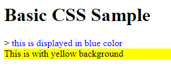

# CSS

CSS is used to describe how a HTML document is displayed. We can customize a single tag, or a group of tags or a tag type with a different display style using CSS.

The following are the topics that we need to learn to use CSS successfully in HTML Web pages:
* Different ways to use CSS in HTML 
* CSS Selectors
* CSS attributes

A Simple Example for styles in a HTML Document:
```HTML
<html>
    <head>
        <style>
            span {
                color: blue;
            }
            div {
                background-color: yellow;
            }
        </style>
    </head>
    <body>
        <h1>Basic CSS Sample</h1>
        <span>this is displayed in blue color</span>
        <div>This is with yellow background</div>
    </body>
</html>
```
The above HTML page will display like this:


## Different ways to use CSS in HTML

There are three ways to insert a style to HTML page:
* Inline CSS
* External CSS
* Internal CSS

Checkout following link for more details
https://www.w3schools.com/css/css_howto.asp

### Inline CSS
If there is limited change to the display style of a tag, then we can add a `style` attribute to the HTML tag and the value of the `style` attribute can be CSS styles supported for the HTML tag.
**Example***
```HTML
<html>
<body style='background-color: lightblue;'>
    <h1 style='color: navy; margin-left: 20px;'>This is a heading</h1>
    <p>This is a paragraph.</p>
</body>
</html>
```


### Internal CSS
If there are limited number of styles, we can embed them inside the HTML page itself within the `<style>` tag. It is recommended to keep the `style` tag inside the `head` tag.
**Example (index.html)**
```HTML
<html>
<head>
    <style>
        body {
            background-color: lightblue;
        }
        h1 {
            color: navy;
            margin-left: 20px;
        }
    </style>
</head>
<body>
    <h1>This is a heading</h1>
    <p>This is a paragraph.</p>
</body>
</html>
```
### External CSS
If we have a lot of css style definitions then keeping it inside a HTML page makes it too large. If we have css styles commonly used in multiple HTML pages then we do not want to repeat defining same styles in all HTML files. Instead we can define all css styles in a separate .css file and then include this css file in the required HTML pages.
Use the `<link rel="stylesheet" type="text/css" href="mystyle.css">` tag to include an external css file.

**Example (index.html)**
```HTML
<!DOCTYPE html>
<html>
<head>
<link rel="stylesheet" type="text/css" href="mystyle.css">
</head>
<body>

<h1>This is a heading</h1>
<p>This is a paragraph.</p>

</body>
</html>
```
**Example (mystyle.css)**
```css
body {
  background-color: lightblue;
}

h1 {
  color: navy;
  margin-left: 20px;
}
```

## CSS Syntax
A CSS rule-set consists of a selector and a declaration block:

* **selector** points to the HTML element for which the display style is being customized. In the following example, `h1` is the selector.
* **declaration block** contains one or more declarations separated by semicolons. The declaration block is always surrounded inside a pair of curly braces { }. In the following example `color: blue; font-siz: 12px;` is the declearation block.
* **declaration** includes a CSS property name and a value, separated by a colon. A CSS declaration always ends with a semicolon. In the following example, `color: blue;` is one declaration and `font-size: 12px;` is another declaration.
```css
h1 {
    color: blue;
    font-siz: 12px;
}
```

## CSS Selectors

To customize the display style of HTML tags we need to define how the browser finds the HTML tag inside the HTML document. We can instruct the browser to find the HTML tag by tag name or id or class or combination of the tag's properties.
### Element Selector
If we specify a tagname as selector then all tags in the HTML with the specific tagname wil be affected.
**Example**
```css
p {
    color: blue;
}
```
The above example ensures the content of all the `<p>` tags in the HTML document display text in the blue color.

### ID Selector
If we specify an id as selector then any tag in the HTML with the specific **`id`**  wil be affected.
**Example (CSS)**
```css
#instruction {
    color: blue;
}
```
**Example (HTML)**
```HTML
<html>
<body>
    <p>Welcome</p>
    <p id='instruction'>Please read all the conditions carefully</p>
    <p> ... terms and conditions ... </p>
</body>
</html>
```
The above example ensures the content of the `<p>` tag with **`id='instruction'`** will display in the blue color =>  `Please read all the conditions carefully` will display in blue color, but the other text will display in normal black color.

### Class Selector
If we specify a class as selector then any tag in the HTML with the specific **`class`**  wil be affected.
**Example (CSS)**
```css
.highlight {
    background-color: yellow;
}
```
**Example (HTML)**
```HTML
<html>
<body>
    <p>Welcome</p>
    <p class='highlight'>Please read all the conditions carefully</p>
    <p> ... terms and conditions ... </p>
</body>
</html>
```
The above example ensures the content of the `<p>` tag with **`class='highlight'`** will display in yellow background =>  `Please read all the conditions carefully` will display with yellow background, but the other text will display normally.

### Universal selector
To select all tags in a HTML document use `*` as selector. The following example ensures all tags in the HTML document are displayed in blue color and aligned in center.
```css
* {
  text-align: center;
  color: blue;
}
```

### Grouping Selectors
To define the same style for multiple tags (or selectors) we can define more than one selector separated by comma. For example the following definition ensures both **`p`** and **`span`** tags are displayed in green. If there is a `div` tag in the same HTML document, then contents of `div` tag will display normally.
```css
p, span {
  color: green;
}
```
For more information try: https://www.w3schools.com/css/css_selectors.asp

### CSS Combinators
A combinator is something that explains the relationship between the selectors. A CSS selector can contain more than one simple selector. Between the simple selectors, we can include a combinator.

There are four different combinators in CSS:
* descendant selector (*space*)
* child selector (**`>`**)
* adjacent sibling selector (**`+`**). Selects only next sibling
* general sibling selector (**`~`**). Selects all siblings with given selector

|Selector | Example | Example description|
|--|--|--|
|element element | `div p` | Selects all **`<p>`** elements inside **`<div>`** elements|
|element`>`element | `div > p` | Selects all **`<p>`** elements where the parent is a **`<div>`** element|
|element`+`element | `div + p` | Selects all **`<p>`** elements that are placed immediately after **`<div>`** elements|
|element1`~`element2 | `p ~ ul` | Selects every **`<ul>`** element that are preceded by a **`<p>`** element|

### Psuedo Selectors
A pseudo-class is used to define a special state of an element. For example, it can be used to:
* Style an element when a user mouses over it
* Style visited and unvisited links differently
* Style an element when it gets focus

For example the following definition ensures the color of link changes to green only when mouse cursor is passed over the link:
```css
/* mouse over link */
a:hover {
  color: green;
}
```

Details in https://www.w3schools.com/css/css_pseudo_classes.asp

| Selector | Example | Example description|
|--|--|--|
|:active | a:active | Selects the active link|
|:checked | input:checked | Selects every checked `<input>` element|
|:disabled | input:disabled | Selects every disabled `<input>` element|
|:empty | p:empty | Selects every `<p>` element that has no children|
|:enabled | input:enabled | Selects every enabled `<input>` element|
|:first-child | p:first-child | Selects every `<p>` elements that is the first child of its parent|
|:first-of-type | p:first-of-type | Selects every `<p>` element that is the first <p> element of its parent|
|:focus | input:focus | Selects the `<input>` element that has focus|
|:hover | a:hover | Selects links on mouse over|
|:in-range | input:in-range | Selects `<input>` elements with a value within a specified range|
|:invalid | input:invalid | Selects all `<input>` elements with an invalid value|
|:lang(language) | p:lang(it) | Selects every `<p>` element with a lang attribute value starting with "it"|
|:last-child | p:last-child | Selects every `<p>` elements that is the last child of its parent|
|:last-of-type | p:last-of-type | Selects every `<p>` element that is the last `<p>` element of its parent|
|:link | a:link | Selects all unvisited links|
|:not(selector) | :not(p) | Selects every element that is not a `<p>` element|
|:nth-child(n) | p:nth-child(2) | Selects every `<p>` element that is the second child of its parent|
|:nth-last-child(n) | p:nth-last-child(2) | Selects every `<p>` element that is the second child of its parent, counting from the last child|
|:nth-last-of-type(n) | p:nth-last-of-type(2) | Selects every `<p>` element that is the second `<p>` element of its parent, counting from the last child|
|:nth-of-type(n) | p:nth-of-type(2) | Selects every `<p>` element that is the second `<p>` element of its parent|
|:only-of-type | p:only-of-type | Selects every `<p>` element that is the only `<p>` element of its parent|
|:only-child | p:only-child | Selects every `<p>` element that is the only child of its parent|
|:optional | input:optional | Selects `<input>` elements with no "required" attribute|
|:out-of-range | input:out-of-range | Selects `<input>` elements with a value outside a specified range|
|:read-only | input:read-only | Selects `<input>` elements with a "readonly" attribute specified|
|:read-write | input:read-write | Selects `<input>` elements with no "readonly" attribute|
|:required | input:required | Selects `<input>` elements with a "required" attribute specified|
|:root | root | Selects the document's root element|
|:target | #news:target | Selects the current active #news element (clicked on a URL containing that anchor name)|
|:valid | input:valid | Selects all `<input>` elements with a valid value|
|:visited | a:visited | Selects all visited links|

### All CSS Pseudo Elements
A CSS pseudo-element is used to style specified parts of an element. This can either be used to add more content or style specific part of an element.

|Selector | Example | Example description|
|--|--|--|
|::after | p::after | Insert content after every **`<p>`** element|
|::before | p::before | Insert content before every **`<p>`** element|
|::first-letter | p::first-letter | Selects the first letter of every **`<p>`** element|
|::first-line | p::first-line | Selects the first line of every **`<p>`** element|
|::selection | p::selection | Selects the portion of an element that is selected by a user|

### All CSS Attribute Selectors
Similar to id/class selector we can also select using specific attributes. To do this we need to enclose the attribute name inside the square braces [ ]. We can either specify only attribute name, or attribute name-value pair, advanced combinations. 

|Selector | Example | Example description|
|--|--|--|
|`[attribute]` | `[target]` | Selects all elements with a `target` attribute|
|`[attribute=value]` | `[target=_blank]` | Selects all elements with `target="_blank"`|
|`[attribute~=value] `| `[title~=flower] `| Selects all elements with a title attribute containing the word "`flower`"|
|`[attribute|=value]` | `[lang|=en]` | Selects all elements with a lang attribute value starting with "en"|
|`[attribute^=value]` | `a[href^="https"]` | Selects every **`<a>`** element whose `href` attribute value begins with "`https`"|
|`[attribute$=value]` | `a[href$=".pdf"]` | Selects every **`<a>`** element whose href attribute value ends with ".pdf"|
|`[attribute*=value]` | `a[href*="w3schools"]` | Selects every **`<a>`** element whose href attribute value contains the substring "w3schools"|